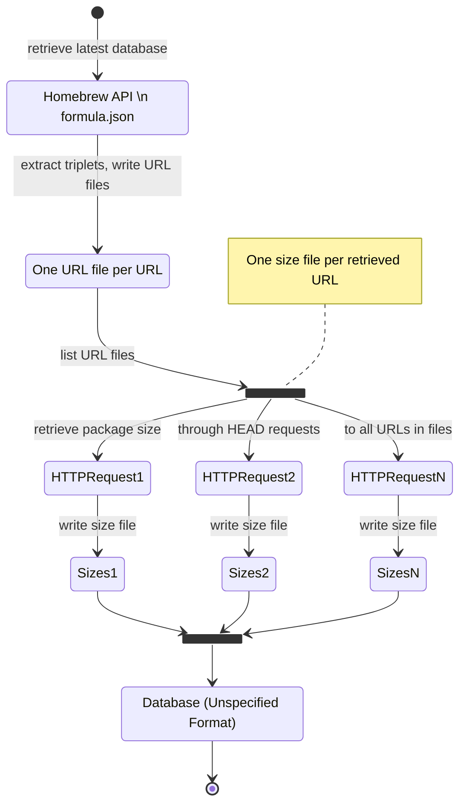

# Homebrew Bottle Size Analysis

Analyzing the size of Homebrew formulae bottles

## Intent

The [Homebrew formula JSON API](https://formulae.brew.sh/docs/api) does not provide package size information for bottles[^def_bottle].
I aim to retrieve package sizes regularly in order to build a database of `(package, version, bottle_arch) -> size` pairs for future analysis.
This analysis could capture:

- Package growth over time
- Total estimated archive size
- Spikes in package size indicating significant changes warranting further inspection
- Expired or broken package URL for rarely-updated formulae with rarely-downloaded bottles
- Packages to target for size optimization, from individual relief to [humanity-scale savings](https://daniel.haxx.se/blog/2022/12/06/faster-base64-in-curl/).

This is **currently** mostly an experiment in using simple CLI tools like Make and curl
to do some data engineering and science that has the above useful implications.

### Current principles

- KISS, to the level of probably dumb.
- Use CLI tools as much as possible; keep code to a minimum.
- [Anything that can be installed via Homebrew](https://formulae.brew.sh) is fair to use.
- Prioritize concurrency using simple tools such as Make `-j`, xargs, parallel, fd, ripgrep, etc.
- Rebuilding the database from scratch means losing data, so avoid that.

## Usage

```sh
make formula.json  # get the data file
make urls          # split it out
make sizes         # get the sizes
```

## Architecture



## Performance notes

It takes around 80 minutes to run for me two requests at a time in order not to
trigger some kind of speed limit at my ISP level [^not_ghcr].

You can check the counts of urls and size files by running something like this:

```sh
fd .url data | wc -l
fd .size data | wc -l
```

If the numbers are the same, you've got the data for the current `formula.json`.

[^def_bottle]: A _bottle_ is a pre-packaged archive of a formula available in Homebrew.
    See <https://docs.brew.sh/Bottles> for more information.

[^not_ghcr]: It's not ghcr.io rate-limiting me.
    My gateway is working fine but my ISP drops the upstream connection.
    It's probably some kind of DDOS protection at the DNS level.
    See notes.txt for ways I might get around this since curl does
    a DNS lookup every time it launches.
